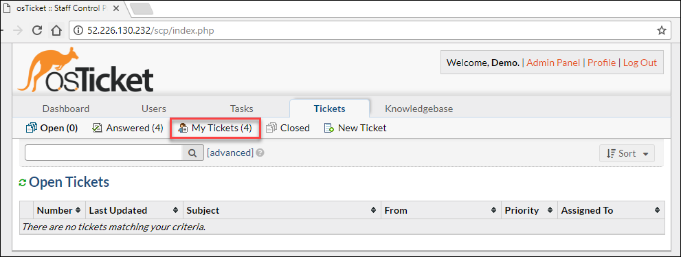
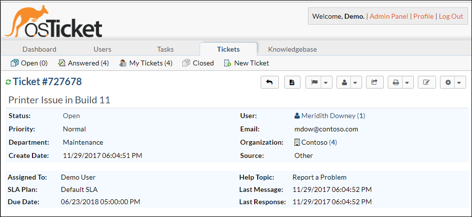
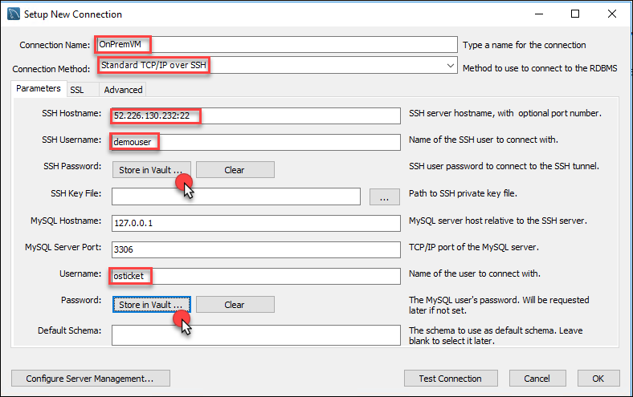

# LAMP lift and shift PoC

This folder contains starter artifacts provided by Contoso for migrating their on-premises based helpdesk application called OsTicket to Azure. OsTicket is Linux-based using Apache, PHP and MySQL (LAMP). They would like you to ensure zero data loss during migration.

The expected tasks you should perform are to lift and shift the application from on-premises to Azure IaaS using an auto scaling Virtual Machine Scale Set and MySQL cluster with multiple nodes.

Since they ultimately want to migrate to PaaS, you will migrate from the VM Scale Set to PaaS using Azure App Services with a Docker container and Azure Database for MySQL.

## Help references

|                                                           |                                                                                                                             |
| --------------------------------------------------------- | :-------------------------------------------------------------------------------------------------------------------------: |
| **Description**                                           |                                                          **Links**                                                          |
| Azure Database for MySQL                                  |                                       <https://docs.microsoft.com/en-us/azure/mysql/>                                       |
| Azure Database for MySQL                                  |                      <https://docs.microsoft.com/en-us/azure/mysql/howto-create-manage-server-portal/>                      |
| Azure Database for MySQL                                  |                     <https://docs.microsoft.com/en-us/azure/mysql/howto-manage-firewall-using-portal/>                      |
| Connect Azure Web App to Azure Database for MySQL         |                            <https://docs.microsoft.com/en-us/azure/mysql/howto-connect-webapp/>                             |
| Azure Virtual Machine Scale Sets                          |                            <https://docs.microsoft.com/en-us/azure/virtual-machine-scale-sets/>                             |
| Using VM Extensions with Azure Virtual Machine Scale Sets | <https://docs.microsoft.com/en-us/azure/virtual-machine-scale-sets/virtual-machine-scale-sets-deploy-scaling-app-template/> |
| App Service for Linux                                     |                  <https://docs.microsoft.com/en-us/azure/app-service/containers/app-service-linux-intro/>                   |
| Azure CLI                                                 |                               <https://docs.microsoft.com/en-us/cli/azure/install-azure-cli/>                               |

## Assets

Deploy a VM using the ARM template, to act as the on-premises installation of the OsTicket application:

```bash
    az group deployment create --name OsTicketOnPremRG --resource-group OsTicketOnPremRG --template-uri "https://cloudworkshop.blob.core.windows.net/linux-lift-shift/onpremvmdeploy.json"
```

The VM contains the following:

- Ubuntu Linux 16.04-LTS VM with Apache
- PHP
- MySQL
- Sample data in the application that you need to ensure doesn't get lost during the migration

## How to log into and explore the OsTicket system

Use the public IP address created in the resource group to browse to the site.

    

Use the **Sign in** link in the upper-right hand corner of the screen to go to the log in page, then locate **I'm an agent** and click the corresponding **sign in here** link.

    

You can use the following credentials:

    -  Username: ***demouser***

    -  Password: ***demo@pass123***

    

Once logged into the OsTicket system, click **My Tickets**

    

On the **My Tickets** screen, click through to one of the tickets

    

Next, click the **Users** tab and notice the users that are entered into the system

    

Feel free to create new tickets or new users to add to your dataset.

You'll need to connect to the MySQL database to view its information and to export the data. Here are the steps to connect to it:

Enter the following information to configure to connect to your **OnPremVM**:

    -   Connection Name: **OnPremVM**

    -   Connection Method: **Standard TCP/IP over SSH**

    -   SSH Hostname: **\<enter the Public ip address\>**

    -   SSH Username: **demouser**

    -   SSH Password: **Click Store in Vault: demo@pass123**

    -   MySQL Hostname: **127.0.0.1**

    -   MySQL Server Port: **3306**

    -   Username: **osticket**

    -   Password: **Click Store in Vault: demo@pass123**

    

## OsTicket source code for deploying to Azure

Contoso has the most up-to-date source code they would like you to use to deploy to PaaS. First, you will need to fork this repo and update the [./osticket-master/include/ost-config.php](./osticket-master/include/ost-config.php) file to configure the new **DBHOST** and **DBUSER** values for the new MySQL Cluster you provision in Azure. After making the changes, and committing them, you can deploy to Azure using the deployment options in App Services, or however you wish to do it.
