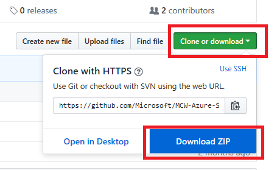

# Secure data PoC starter artifacts

> **TODO:** the ARM template contains the following path: https://github.com/givenscj/mcw-azure-security/blob/master/Scripts/Install_IIS.zip?raw=true. This needs to be updated to the path to [./Scripts/Install_IIS.zip](./Scripts/Install_IIS.zip) once this repo has been set up in its final location on GitHub.

These starter artifacts provided by Contoso might help you accelerate your PoC efforts for secure data.

## What the starter contains

- ARM template that creates the following:
  - One storage account
  - Three virtual networks
  - Three network security groups
  - Three virtual machines (db-1, web-1, paw-1)
    - IIS is installed on web-1 via a DSC script from the GitHub repository
  - One SQL Azure Server
  - One Azure Key Vault
- Insurance API source code
- Insurance.bacpac file for SQL database

## Starter setup

Setup will take around **30 minutes** to complete. What you need to get started is the following:

- Microsoft Azure subscription must be pay-as-you-go or MSDN
  - Trial subscriptions will not work
- A machine with the following software installed:
  - Visual Studio 2017
  - SQL Management Studio 2017

### Task 1: Download GitHub resources

1.  Open a browser window to the GitHub repository that contains the starter artifacts

2.  Select **Clone or download**, then select **Download Zip**

    

3.  Extract the zip file to your local machine. Browse to the `\Starter-artifacts\resources\secure-data-starter\` directory. You should now see a set of folders:

    

### Task 2: Deploy resources to Azure

1.  Open your Azure Portal

2.  Select **Resource groups**

3.  Select **+Add**

4.  Type a resource group name, such as **azsecurity-\[your initials or first name\]**

5.  Select **Create**

6.  Select **Refresh** to see your new resource group displayed and select it

7.  Select **Automation Script**, and then select **Deploy**

    

8.  Select **Build your own template in the editor**

9.  In the extracted folder, open the **\\Scripts\\template.json**

10. Copy and paste it into the window

11. Select **Save**, you will see the dialog with the input parameters. Fill out the form:

    a. Subscription: select your **subscription**

    b. Resource group: Use an existing Resource group, or create a new one by entering a unique name, such as **azsecurity-\[your initials or first name\]**

    c. Location: Select a **location** for the Resource group. Recommend using East US, East US 2, West Central US, or West US 2.

    d. Modify the **sqlservername** to be something unique such as "azsecurity-\[your initials or first name\]"

    e. Fill in the remaining parameters, but if you change anything, be sure to note it for future reference

    NOTE: User Object Id is meant to be the object id of a user that will be added as an administrator to an Azure Key Vault instance. You can type anything here but the permission assignment with fail in the ARM template later unless it is a valid Azure Active Directory User Object Id. You can find your object id by opening a new Azure portal window and navigating to the Azure Active Directory blade, select **Users**, search for your user account, select it, in the window you will see the **Object ID** field. Click the copy link, then paste the value into the template object user id text box.

    f. Check the **I agree to the terms and conditions stated above** checkbox

    g. Select **Purchase**

        

12. The deployment will take 15-30 minutes to complete. To view the progress, select the **Deployments** link, then select the **Microsoft.Template** deployment.

    

    h. As part of the deployment, you will see the following items created:

        -   One storage account

        -   Three virtual networks

        -   Three network security groups

        -   Three virtual machines (db-1, web-1, paw-1)

            -   IIS is installed on web-1 via a DSC script from the GitHub repository

        -   One SQL Azure Server

        -   One Azure Key Vault

            

## How to use the starter

- Setup the PAW-1 Virtual Machine with JIT Access
- Submit a request to activate the JIT
- Login to the PAW-1 VM via RDP
- Restore the Insurance.bacpac file (Insurance database) to the Azure SQL Server setup in your Azure tenant
- Create a user called agent that has db_reader access to the Insurance database
- Open the InsuranceAPI solution
- Modify the web.config file to point to your new Insurance database
- Run the web application, navigation to [http://localhost:portno/api/Users](http://localhost:portno/api/Users). You should see unmasked data displayed.
- Configure the Azure DB User table, SSN column to have data masking
- Refresh the [http://localhost:portno/api/Users](http://localhost:portno/api/Users) page. You should see data displayed but the SSN should be masked.
- Configure the SSN column to utilize Azure Key Vault for column encryption
- Execute a "select \* from User" SQL Management Query that shows the SSN column as encrypted
- Open the InsuranceAPI_KeyVault solution
- Migrate the connection string to an Azure Key Vault secret
- Create a new Azure AD application
- Assign the Azure AD application with access to the Azure Key Vault secret
- Ensure that the Microsoft.IdentityModel.Clients.ActiveDirectory and Microsoft.Azure.KeyVault nuget packages exist for the project
- Configure the web app to utilize an Azure AD clientId and secret to gain access to the Azure Key Vault secret for the EntityFramework ConnectionString
- Data is successfully displayed on the [http://localhost:portno/api/Users](http://localhost:portno/api/Users) page
